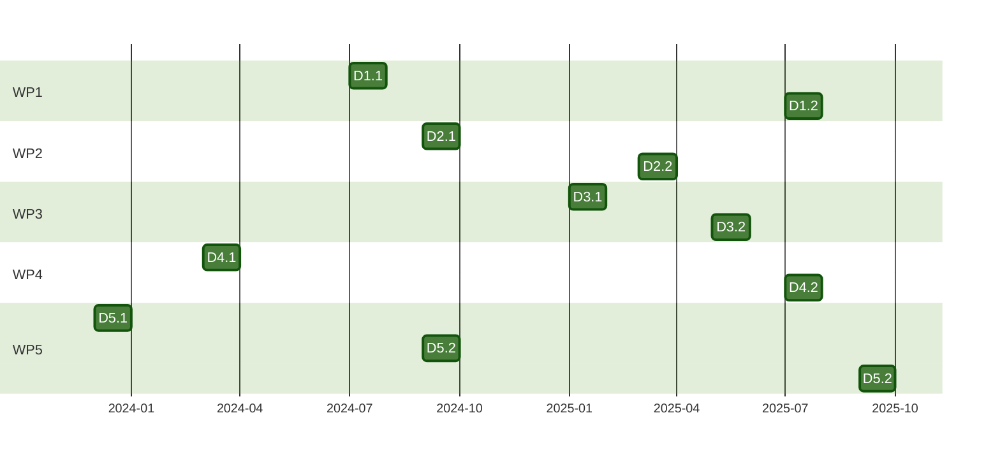

<h3>Expected deliverables</h3>

The project will produce several deliverables including land use maps, dataset on carbon sequestration and fire risk maps. Expected deliverables are:
- D1.1 : Five-year maps and quantitative estimates of expected land cover under climate change and choice of rewilding strategy until 2060.
- D1.2 : Rewilding potential and priority regions at EU scale.

- D2.1 : Dataset on carbon sequestration following reforestation and proforestation.
- D2.1 : Dynamic models for reforestation and proforestation.
  
- D3.1 : Maps of burnt area and high fire risk zones at each replicated landscape.
- D3.2 : Estimates of carbon emissions by land use class within each eco-region to project carbon changes in environmental space and over time.
  
- D4.1 : Website, dissemination plan and graphic identity.
- D4.2 : Policy brief.
  
- D5.1 : Project guidebook.
- D5.2 : Reports of the kick-off meeting and annual General assembly meetings.

<h3>Expected calendar of the project</h3>

banner:
  image: 'logosEU.svg'
  caption: ''

