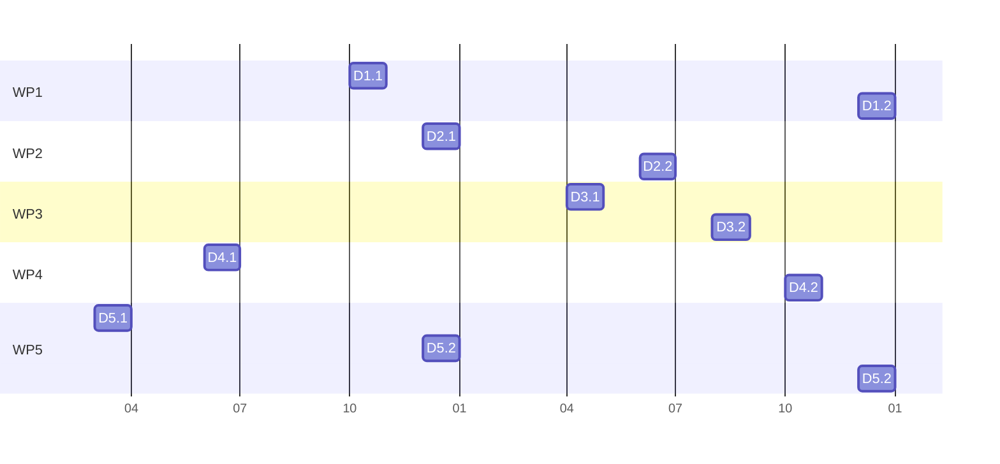
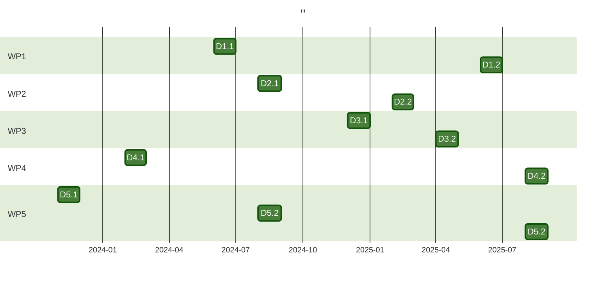

<h3>Expected deliverables</h3>

<h3>Calendar</h3>
        

```mermaid
gantt
  dateFormat  YY-MM
  axisFormat %m
  section WP1
  D1.1     :a1, 01-10, 1M
  D1.2     :a2, 02-12, 1M
  section WP2
  D2.1     :a3, 01-12, 1M
  D2.2     :a4, 02-06, 1M
  section WP3
  D3.1     :a5, 02-04, 1M
  D3.2     :a6, 02-08, 1M
  section WP4
  D4.1     :a7, 01-06, 1M
  D4.2     :a8, 02-10, 1M
  section WP5
  D5.1     :a9, 01-03, 1M
  D5.2     :a10, 01-12, 1M
  D5.2     :a11, 02-12, 1M
```

```mermaid
%%{init: {'theme':'forest'}}%%
gantt
  title ''
  dateFormat  YYYY-MM
  axisFormat %Y-%m
  section WP1
  D1.1     :a1, 2024-06, 1M
  D1.2     :a2, 2025-06, 1M
  section WP2
  D2.1     :a3, 2024-08, 1M
  D2.2     :a4, 2025-02, 1M
  section WP3
  D3.1     :a5, 2024-12, 1M
  D3.2     :a6, 2025-04, 1M
  section WP4
  D4.1     :a7, 2024-02, 1M
  D4.2     :a8, 2025-08, 1M
  section WP5
  D5.1     :a9, 2023-11, 1M
  D5.2     :a10, 2024-08, 1M
  D5.2     :a11, 2025-08, 1M
```
