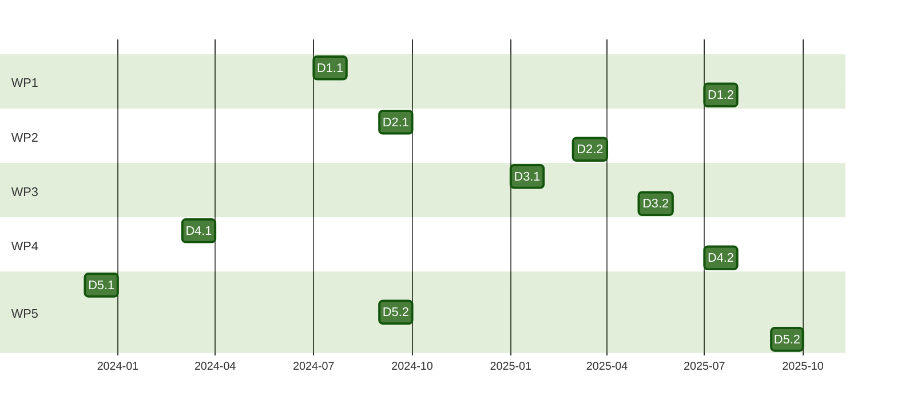

<h3>Expected deliverables</h3>

The project will produce several deliverables including land use maps, dataset on carbon sequestration and fire risk maps. Expected deliverables are:
- D1.1 : Five-year maps and quantitative estimates of expected land cover under climate change and choice of rewilding strategy until 2060
- D1.2 : Rewilding potential and priority regions at EU scale

- D2.1 : Dataset on carbon sequestration following reforestation and proforestation
- D2.2 : Dynamic models for reforestation and proforestation
  
- D3.1 : Maps of burnt area and high fire risk zones at each replicated landscape
- D3.2 : Estimates of carbon emissions by land use class within each eco-region to project carbon changes in environmental space and over time
  
- D4.1 : Website, dissemination plan and graphic identity
- D4.2 : Policy brief
  
- D5.1 : Project guidebook
- D5.2 : Reports of the kick-off meeting and annual General assembly meetings (Internal documents)

<h3>Expected calendar of the project</h3>

```mermaid
%%{init: {'theme':'forest'}}%%
gantt
  dateFormat  YYYY-MM
  axisFormat %Y-%m
  section WP1
  D1.1     :a1, 2024-07, 1M
  D1.2     :a2, 2025-07, 1M
  section WP2
  D2.1     :a3, 2024-09, 1M
  D2.2     :a4, 2025-03, 1M
  section WP3
  D3.1     :a5, 2025-01, 1M
  D3.2     :a6, 2025-05, 1M
  section WP4
  D4.1     :a7, 2024-03, 1M
  D4.2     :a8, 2025-07, 1M
  section WP5
  D5.1     :a9, 2023-12, 1M
  D5.2     :a10, 2024-09, 1M
  D5.2     :a11, 2025-09, 1M

```
