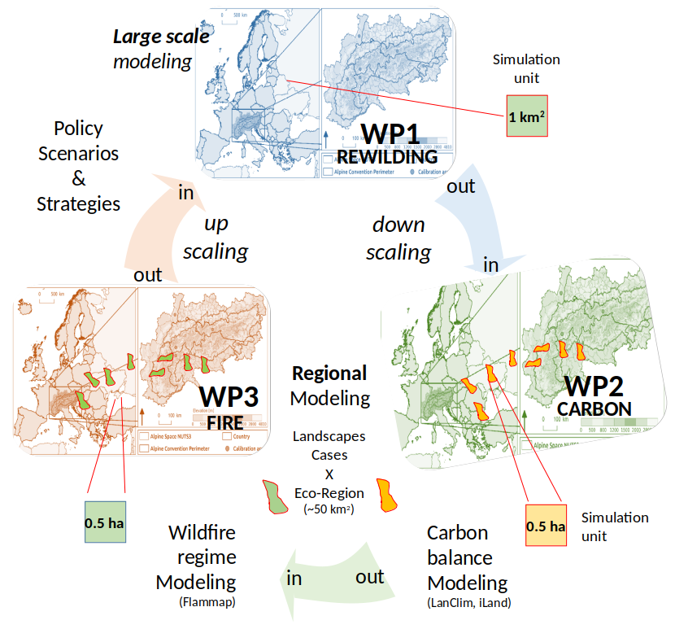

<h3>Context</h3>

Reaching net zero Greenhouse Gas (GHG) emissions by 2050 is key to limit global warming to 1.5°C, and requires in all scenarios active carbon dioxide (CO2) removal (CDR). Nature-based solutions (NBS) offer low-cost options for CDR, which need to be better identified, assessed for their carbon (C) sink potential, and upscaled. NBS include increased protection, restoration, and improved management of forest ecosystems. Rewilding strategies, such as natural reforestation on marginal lands or renaturalization of forests where human action has been interrupted (i.e. "proforestation"), also offer opportunities to increase C sinks. On the other hand, rewilding may also generate unintended consequences, such as increased fire hazard and loss of C through wildfire emissions.

<h3>The project</h3>
        
The REWILD-FIRE will assess the additional C sink associated with promoting reforestation on former agricultural land and proforestation of existing forests. The project will assess tradeoffs between increased biomass C and potential C losses from wildfire emissions and compare choices regarding the spatial planning of reforestation and proforestation throughout the Italian Alps. The project will strive to achieve three specific objectives :

1) **Predicting** land cover changes under different **rewilding and climate change scenarios**
2) **Model** future forest growth and C dynamics under reforestation and proforestation-based rewilding
3) **Assess C losses** due to altered fire regimes under **rewilding and climate change scenarios**

Combining field observations, remote sensing, and vegetation modelling with policy strategies scenarios, REWILD-FIRE will inform regional, national and European policy makers of the contribution of forest NBS to achieve net zero emissions by 2050 in mountain regions. The project will investigate the effect of alternative planning choices to rewilding and identify which ones can better support systemic CDR. REWILD-FIRE will use a dedicated cross-scale analysis, linking site-based measurement to an Alpine-wide assessment of land cover dynamics, embedded in the current EU policy context (i.e. Biodiversity Strategy) and informed by global scenarios.

The three objectives of the project will be achieved by project activities organised in **three interacting work-packages** (Figure 1). 

WP1 will entail spatio-temporal analysis of land cover change (at time steps of 5 years until 2060) expected under two contrasting rewilding policies and two climate scenarios at the whole Italian Alpine scale. For each scenario (2 rewilding x 2 climate), land cover maps will be downscaled at a resolution of 0.5 ha across "landscape cases” of 50 km2 (Figure 2) for modelling C dynamics (WP2) and fire-induced emissions (WP3). The net-C sequestration potential of land cover classes (additional sink under rewilding, minus C losses due to emissions by emerging fire regimes), will be upscaled in WP1 for each 5 year time step for estimating the net-C sink due to policy and climate scenarios across Alpine wildland ecosystems until 2060.

: 1 km2; landscape-scale cases (WP2 and WP3): 0.5 ha and an extent of about 50 km2).")

